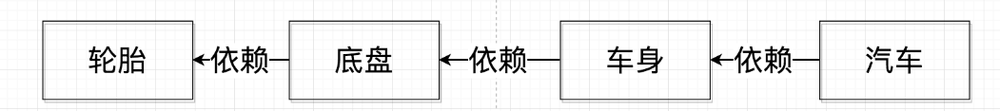
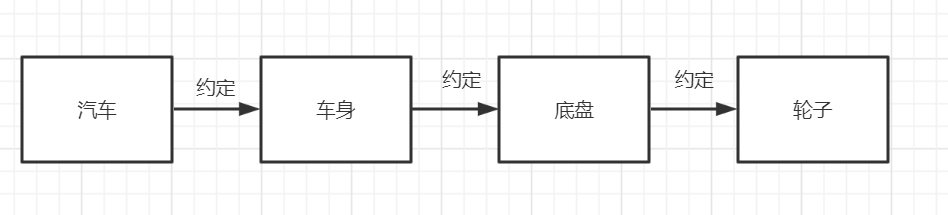
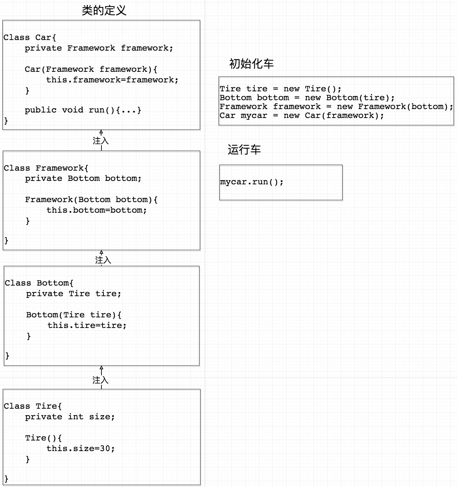
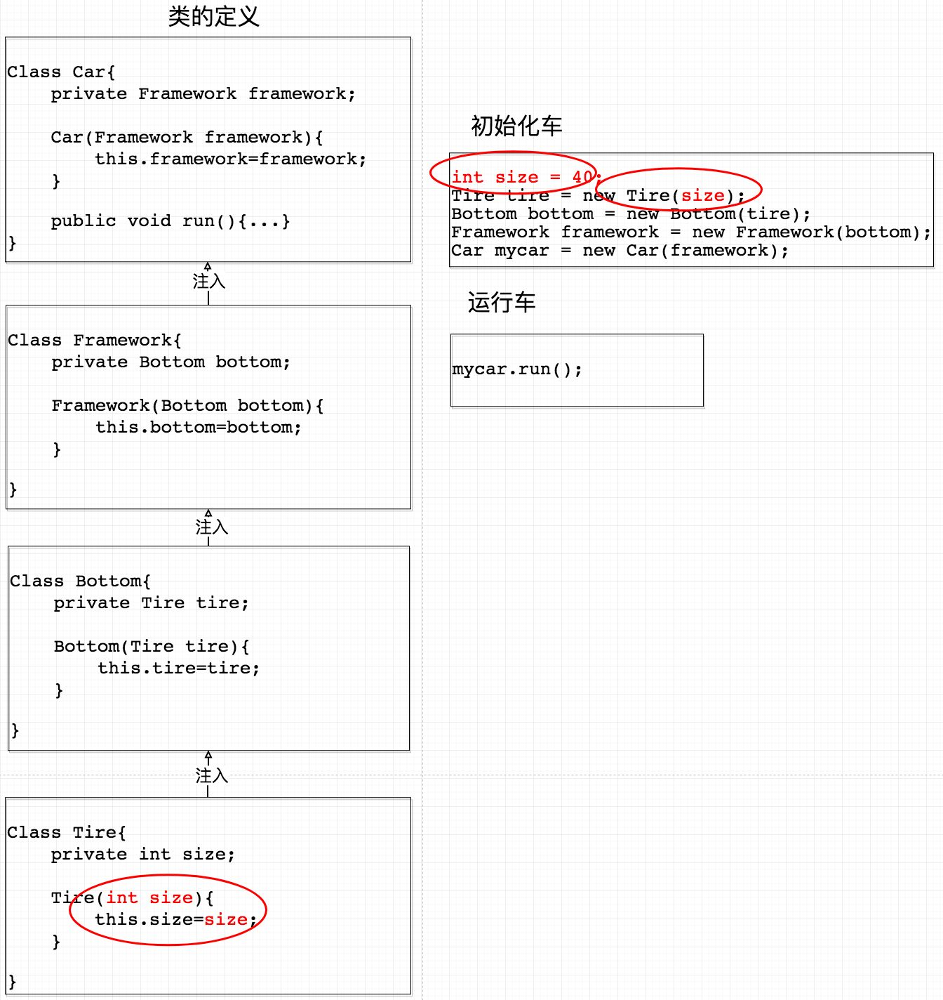
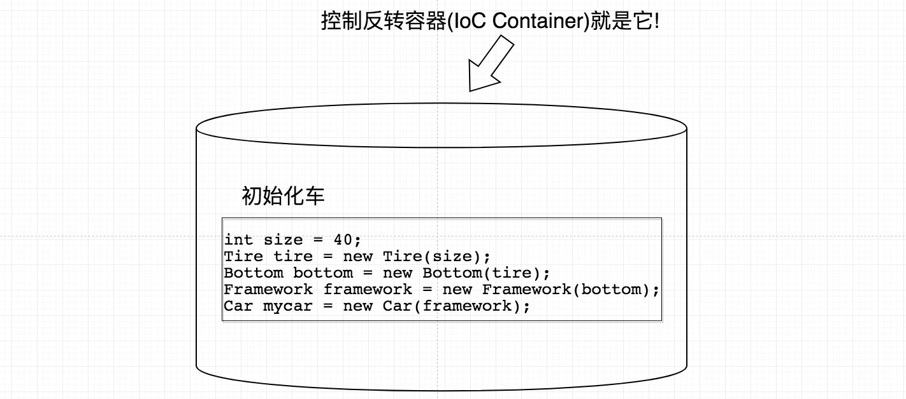
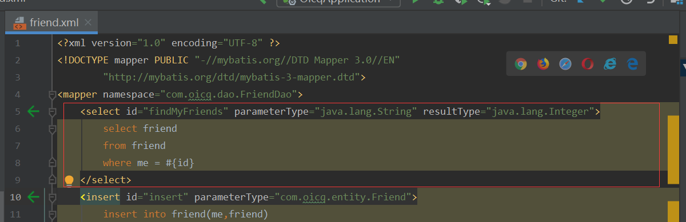
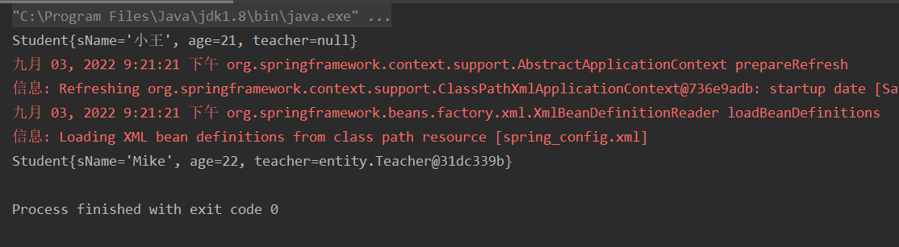
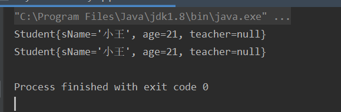

# 一 IOC(Inversion of Control,控制反转)与依赖注入

## 1.1 什么是控制反转IOC

- 首先明确IOC只是一种思想，而DI依赖注入是实现这种思想的方法。

- 假如公司要设计一辆车，首先从别的地方拿来一个轮子，然后再根据这个轮子设计出底盘，然后再根据底盘设计出车身，最后根据车身拼装好整个车。就形成了一个依赖关系：



  但是如果公司想要换一个更大的轮胎，因为设计的时候是相互依赖的，所以就要根据这个新的轮胎进行全部重做。

- 而**控制反转**就是不再相互依赖，而是都依赖接口：

  现在公司想设计一辆车，首先设计车的大概样子，然后下面的人根据这个样子来确定车身的标准，然后车身再设计好底盘的标准，最后根据底盘来确定轮子的标准。形成一种约定的关系：



## 1.2 什么是依赖注入DI

- 用代码的思想来解释就是，**将下层的类作为参数传给上层类**，这样就只专心做自己的事，不用考虑下层类在干什么。



- 如果要把轮胎的size设置为自定义的，就不需要再修改上层类。

  

## 1.3 IOC容器



我们可以把它当成一个工厂，这个工厂可以自动对代码进行初始化，我们只需要在Configuration（可能是XML的代码）中配置一下车的参数，让容器自动根据参数进行初始化，就不需要每次在想要车的时候都要初始化一大段代码。

举个例子：我们想要一个车，就在Configuration中写下想要车的参数，然后把这个单子交给容器工厂，然后这个工厂就会给我们一个想要的车，我们就不用关心这个车是怎么造出来的。

在项目中，我们需要向数据库中查询一个数据，只需要在xml文件中配置sql语句，这样容器工厂就会根据这个配置进行初始化，从数据库取出数据返回。



# 二 结合代码

## 2.1 Spring简单使用

1. 首先创建一个maven项目，在pom.xml文件中导入必要依赖

   ```xml
   <dependencies>
       <!-- Spring 5.0 核心工具包 -->
       <dependency>
           <groupId>org.springframework</groupId>
           <artifactId>spring-core</artifactId>
           <version>5.0.7.RELEASE</version>
       </dependency>
       <!-- Spring 5.0 Bean管理工具包 -->
       <dependency>
           <groupId>org.springframework</groupId>
           <artifactId>spring-beans</artifactId>
           <version>5.0.7.RELEASE</version>
       </dependency>
       <!-- Spring 5.0 context管理工具包 -->
       <dependency>
           <groupId>org.springframework</groupId>
           <artifactId>spring-context</artifactId>
           <version>5.0.7.RELEASE</version>
       </dependency>
       <!-- Spring 5.0 aop支持包 -->
       <dependency>
           <groupId>org.springframework</groupId>
           <artifactId>spring-aop</artifactId>
           <version>5.0.7.RELEASE</version>
       </dependency>
   </dependencies>
   ```

2. 接下来创建两个实体类

   - Teacher.java

     ```java
     public class Teacher {
         private String tName;
     
         public String gettName() {
             return tName;
         }
     
         //必须提供 setter() 方法，因为 Spring 是根据反射机制通过实体类的 setter() 为对象赋值的
         public void settName(String tName) {
             this.tName = tName;
         }
     
         @Override
         public String toString() {
             return super.toString();
         }
     }
     ```

     

   - Student.java

     ```java
     public class Student {
         private String sName;
         private int age;
         private Teacher teacher;
     
         public Student() {
             this.sName = "小王";
             this.age = 21;
         }
     
         //省略setter、getter方法和toString方法
     }
     ```

3. 在ressources目录下添加Spring配置文件，把②中创建的两个实体类注入到IOC容器中。

   spring_config.xml

   ```xml
   <?xml version="1.0" encoding="UTF-8"?>
   <beans xmlns="http://www.springframework.org/schema/beans"
          xmlns:xsi="http://www.w3.org/2001/XMLSchema-instance"
          xmlns:p="http://www.springframework.org/schema/p"
          xmlns:c="http://www.springframework.org/schema/c"
          xsi:schemaLocation=" http://www.springframework.org/schema/beans
           http://www.springframework.org/schema/beans/spring-beans.xsd
           http://www.springframework.org/schema/context
           http://www.springframework.org/schema/context/spring-context.xsd">
       <!-- 这里 bean 的 id 和 class 会以键值对的形式，保存在 IOC 的容器中 -->
       <bean id="teacher" class="entity.Teacher">
           <property name="tName" value="AlanShleby"/>
       </bean>
   
       <bean id="student" class="entity.Student">
           <property name="sName" value="Mike"/>
           <property name="age" value="22"/>
           <property name="teacher" ref="teacher"/>
       </bean>
   
   </beans>
   ```

   

4. 创建启动类

   MyBeanFactoryApplication.java

   ```java
   public class MyBeanFactoryApplication {
       public static void main(String[] args) {
           Student student1 = new Student();
           System.out.println(student1);
           //通过 ClassPathXmlApplicationContext来读取配置文件xml
           ApplicationContext factory = new ClassPathXmlApplicationContext("spring_config.xml");
           //然后就可以看到工厂创建好的实例对象
           Student student = (Student) factory.getBean("student");
           System.out.println(student);
       }
   }
   ```

   

5. 输出结果

   因为在xml中配置了新值，因此输出不同

   

## 2.2 手写BeanFactory

  首先将上一步添加的依赖以及xml文件注释掉，开始手写

1. 定义Bean实体，对应`XML`文件中的 <bean> 标签

   Bean.java

   ```java
   public class Bean {
       private String beanId;
   
       //注入的文件路径
       private String classPath;
   
       //省略setter、getter方法
   }
   ```

   

2. 创建Bean工厂，类似于ApplicationContext

   BeanFactory.java

   ```java
   public class BeanFactory {
       //使用List存放Bean集合
       private List<Bean> beanList;
   
       public List<Bean> getBeanList() {
           return beanList;
       }
   
       public void setBeanList(List<Bean> beanList) {
           this.beanList = beanList;
       }
   
       /**
        * @Description: //TODO 获取Bean实例
        * @Author: wyq
        * @Date 2022/9/3 22:06
        */
       public Object getBean(String beanId) throws Exception {
           Object instance;
           for (Bean bean : beanList) {
               if (beanId.equals(bean.getBeanId())) {
                   String classPath = bean.getClassPath();
                   //要求JVM查找并加载指定路径的类
                   Class classFile = Class.forName(classPath);
                   //调用 newInstance() 默认的构造方法进行实例化,返回一个实例化好的对象
                   instance = classFile.newInstance();
                   return instance;
               }
           }
           return null;
       }
   }
   ```

   

3. 修改启动类

   ```java
   public class MyBeanFactoryApplication {
       public static void main(String[] args) throws Exception {
           Student student1 = new Student();
           System.out.println(student1);
   
           //声明Bean对象，类似xml功能
           Bean bean=new Bean();
           bean.setBeanId("student");
           bean.setClassPath("entity.Student");
           List<Bean> beanList=new ArrayList<Bean>();
           beanList.add(bean);
   
           //向工厂传入配置文件，类似于ApplicationContext
           BeanFactory factory=new BeanFactory();
           factory.setBeanList(beanList);
   
           //查看工厂创建好的实例对象
           Student student=(Student) factory.getBean("student");
           System.out.println(student);
       }
   }
   ```

   

4. 输出结果

   工厂没有接收到赋值的请求，默认使用空参的构造方法

   